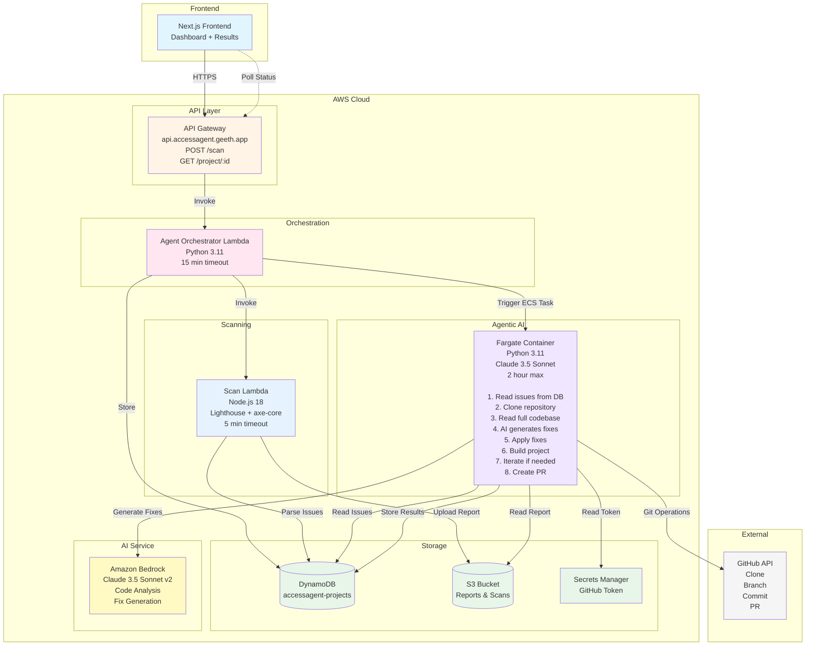
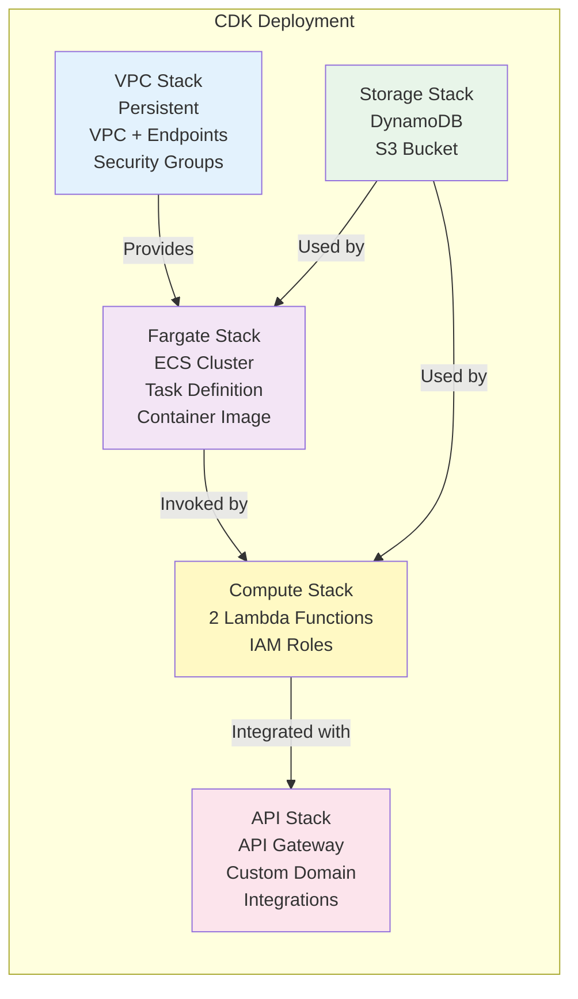
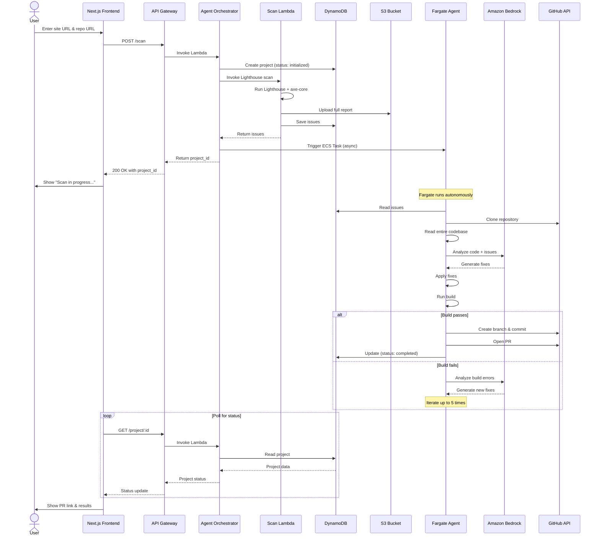
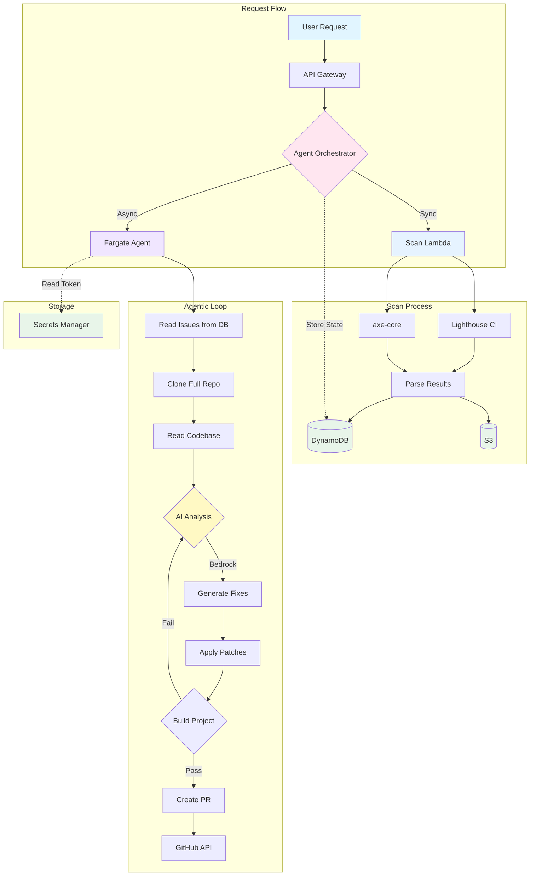
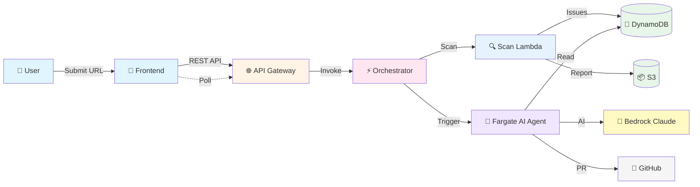
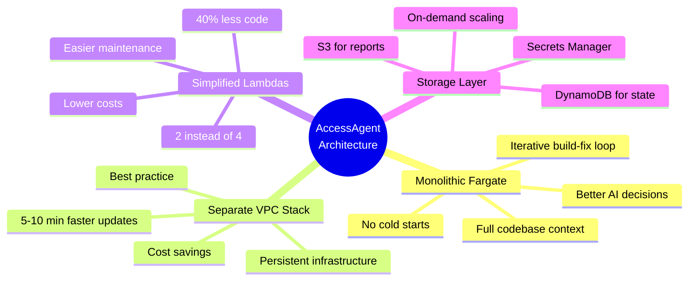
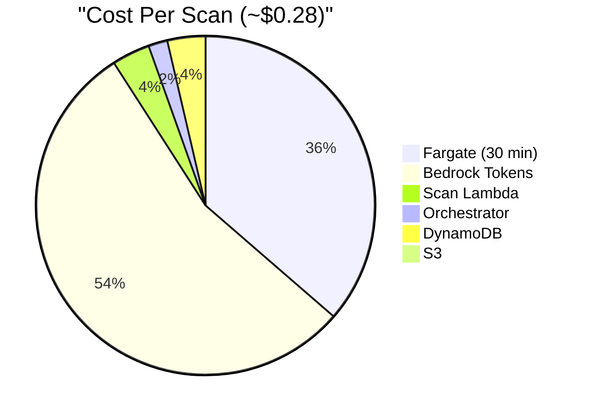

# AccessAgent Architecture Diagram (Mermaid)

## Complete System Architecture

## Infrastructure Stacks (CDK)

## Detailed Data Flow

## Component Interaction

## Simplified Architecture

## Key Architecture Benefits

## Cost Breakdown

---

## Usage

These diagrams can be:
- **Embedded in README.md** (GitHub renders Mermaid)
- **Exported as images** using Mermaid Live Editor
- **Included in presentations** for the hackathon
- **Added to DevPost submission** for judges

## Tools

- **Mermaid Live Editor:** https://mermaid.live
- **VS Code Extension:** Markdown Preview Mermaid Support
- **GitHub:** Native Mermaid rendering in markdown files

---

**Built for AWS AI Agent Global Hackathon 2025**

